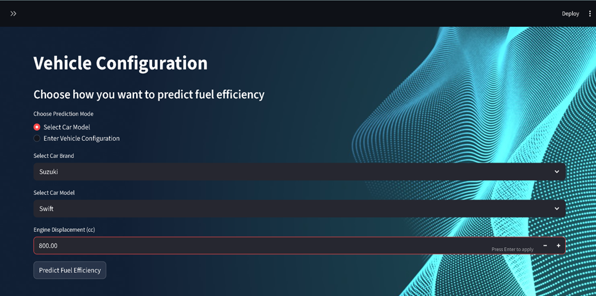
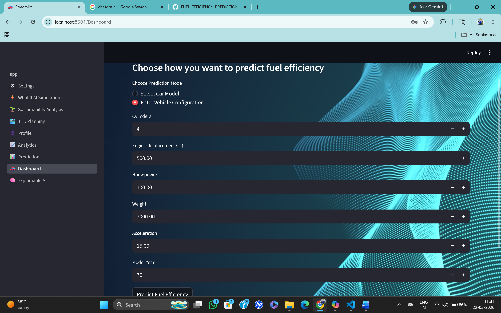
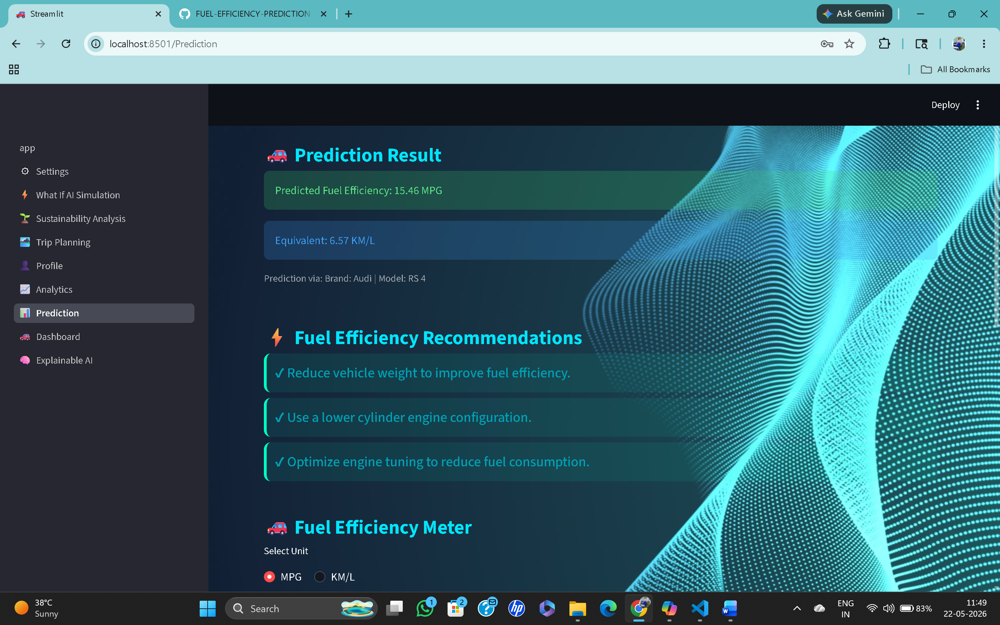
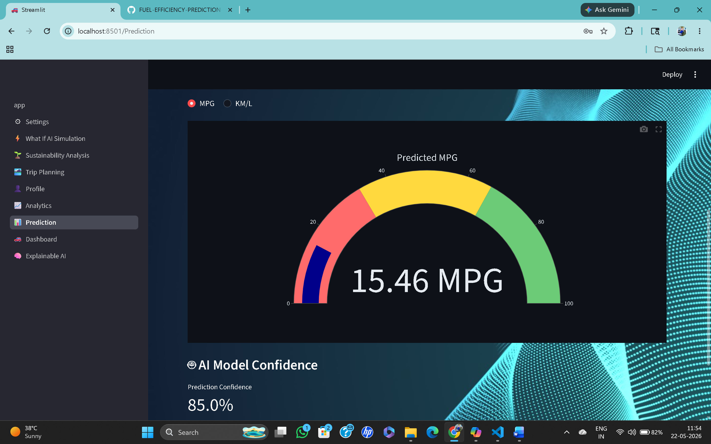
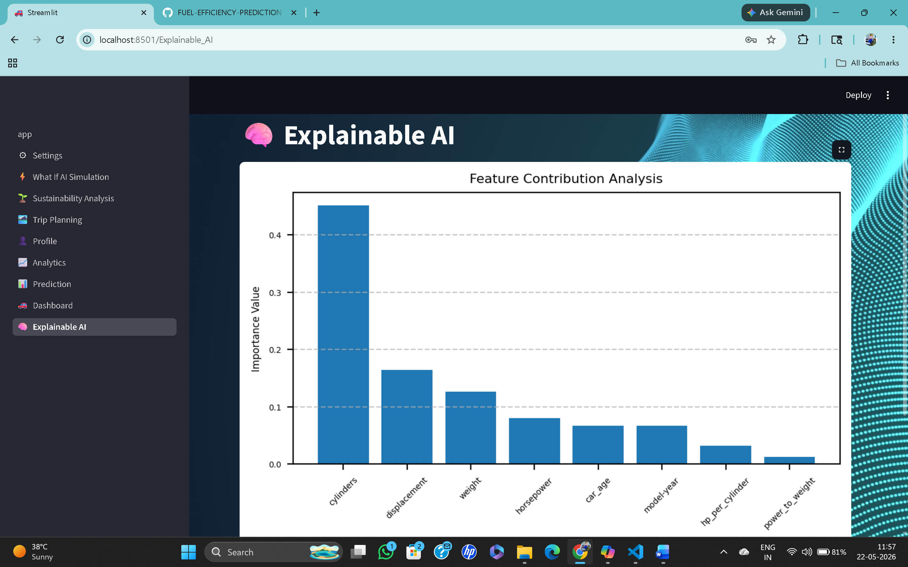
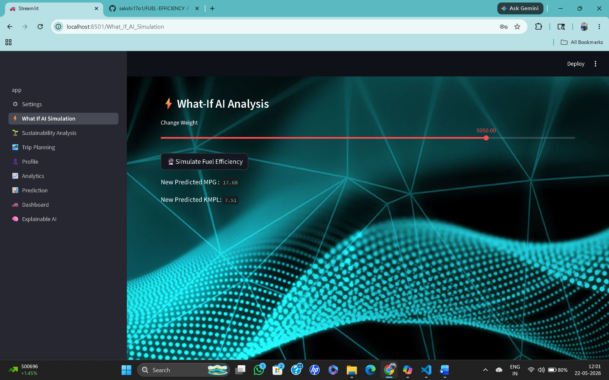
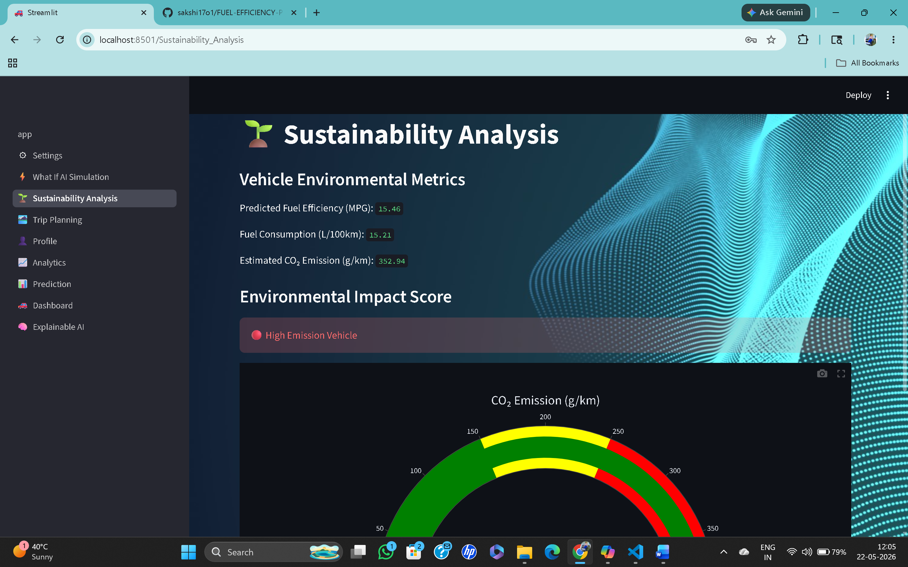
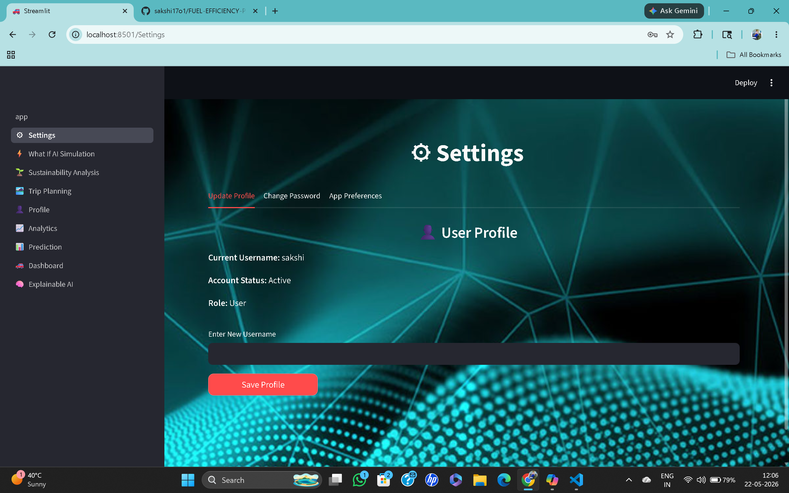
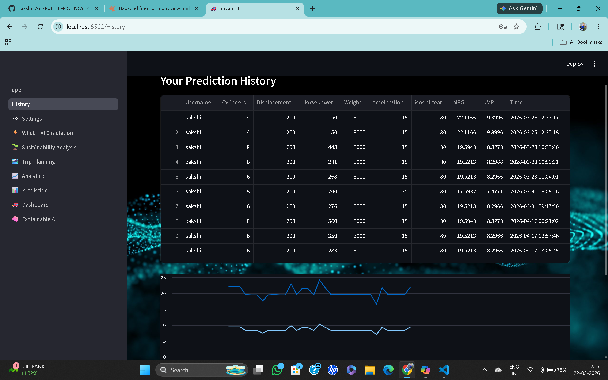

Fuel Efficiency Prediction Project
----------------------------------

FLOWCHART OF THE PROJECT

How to Run: streamlit run app.py

USER INTERFACE OF WEB APP 

🚗 Prediction Result

Visualisation of prediction result

🧠 Explainable AI

⚡What-If AI Analysis
In this user can analyse the prediction by udating the weight of vehicle and then predict the fuel efficiency.

🌱 Sustainability Analysis

⚙ Settings

History 

