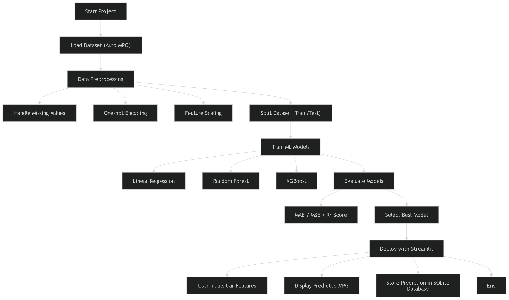

Fuel Efficiency Prediction Project
----------------------------------

Start Project
     |
     v
Load Dataset (Auto MPG)
     |
     v
Data Preprocessing
     |-- Handle Missing Values
     |-- One-hot Encoding
     |-- Feature Scaling
     |
     v
Split Dataset (Train/Test)
     |
     v
Train ML Models
     |-- Linear Regression
     |-- Random Forest
     |-- XGBoost
     |
     v
Evaluate Models
     |-- Calculate MAE
     |-- Calculate MSE
     |-- Calculate R² Score
     |
     v
Select Best Model
     |
     v
Deploy with Streamlit
     |-- User Inputs Car Features
     |-- Display Predicted MPG
     |-- Store Prediction in SQLite Database
     |
     v
End

How to Run: streamlit run app.py

Load data
↓
EDA (Data Understanding)
↓
Data Cleaning
↓
Feature Engineering
↓
Model Training
↓
Evaluation

Google Colab
│
├── Data Cleaning
├── EDA
├── Feature Engineering
├── Model Training
└── Save Model (.pkl)

↓
Streamlit App
│
├── Load trained model
├── Take user inputs
└── Predict MPG

Google Colab
   │
   │ Train + Improve Model
   │
   ▼
Download .pkl
   │
   ▼
VS Code
   │
   │ Load Model
   │
   ▼
Streamlit Frontend

Model Training
      ↓
SHAP Explainability (backend analysis)
      ↓
Feature Importance Visualization
      ↓
User Dashboard# FUEL-EFFICIENCY-PREDICTION-ML
